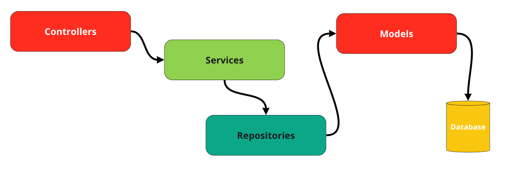

<p align="center"><a href="https://laravel.com" target="_blank"></a></p>

## Laravel Repository Pattern

<p align="center"><a href="#" target="_blank"></a></p>

### Please run this command in root folder to install base configured laravel 10 application.
    sh install.sh

## Documentation for this pattern

### 1. Controllers Management of the REST interface to the business logic
### 2. Services Implement business logic
### 3. Repositories work with a database using models

### Important

- For every model create Repository and RepositoryInterface extended the bases. (See UserRepository and UserRepositoryInterface example)
- After Register Repository in `Providers/RepositoryServiceProvider.php`


- UserRepositoryInterface
```php
<?php

declare(strict_types=1);

namespace App\Repository;

interface UserRepositoryInterface extends BaseRepositoryInterface
{
    public function getByEmail(string $email);
}
```
- UserRepository
```php
<?php

declare(strict_types=1);

namespace App\Repository\Eloquent;

use App\Models\User;
use App\Repository\UserRepositoryInterface;
use Carbon\Carbon;

final class UserRepository
    extends BaseRepository
    implements UserRepositoryInterface
{
    public function __construct(
        User $model,
        private readonly Carbon $carbon
    )
    {
        parent::__construct($model);
    }

    public function getByEmail(string $email): User | bool
    {
        $user = $this->model->where('email', $email);

        if($user->exists())
            return $user->first();

        return false;
    }
}
```

## Important for this pattern
- <font color="red"> Don`t Call any models without Repository </font>


## Additionally

### View Clients and Enums folder.

- For every static types create enum files in Enums Folder and us it.
- Clients - There are examples of created client class for working with external resources. (`See Google client example`)

### Custom commands

- php artisan make:service {{ TestService }}
- php artisan make:repository-interface {{ TestRepositoryInterface }}
- php artisan make:repo {{ TestRepository }}


### System Requirements
- php ^8.1
- Mysql 8

## Done


